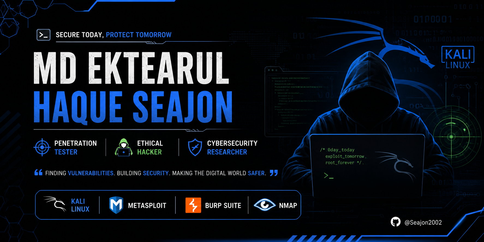

  

# Hi, I'm Md Ektearul Haque Seajon 👋

## 🔐 About Me
Aspiring Penetration Tester, Ethical Hacker, and Cybersecurity Enthusiast.

- 🎓 Software Engineer (Major in Cybersecurity)
- 🛡️ Learning Web Application Security
- 🔍 Interested in VAPT & Bug Bounty
- 🌱 Currently learning Ethical Hacking & Penetration Testing

## 🛠️ Skills

- Kali Linux
- HTML, CSS, JavaScript
- Burp Suite
- Nmap
- Metasploit
- Nessus
- Git & GitHub

## 🎯 Career Goal

To become a skilled Penetration Tester and Cybersecurity Professional specializing in Web Application Security, Vulnerability Assessment, and Ethical Hacking.

## 🏆 Platforms

- LinkedIn: https://www.linkedin.com/in/ektearulhaque/

- TryHackMe: https://tryhackme.com/p/ektearul2002
  

## 📫 Contact

- Email: seajon2502@gmail.com

  
